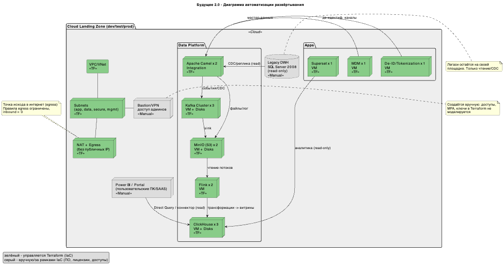
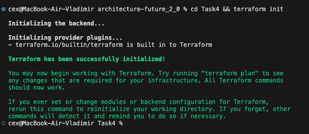
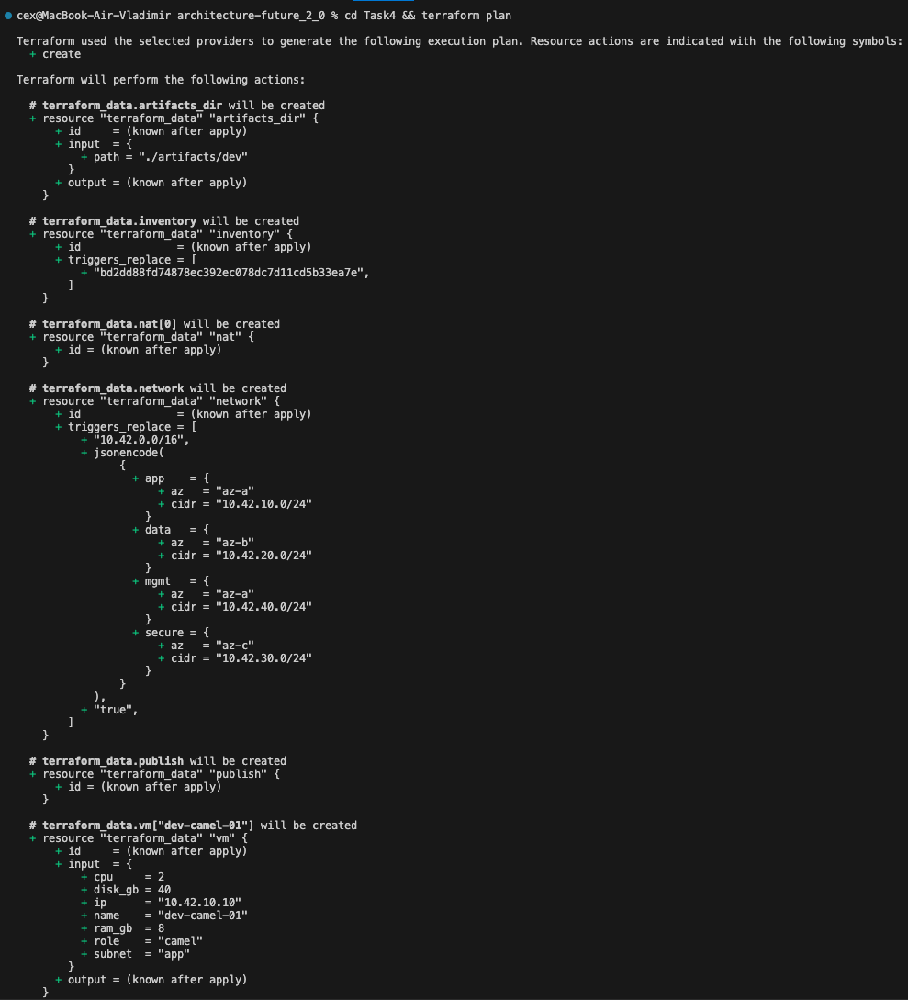
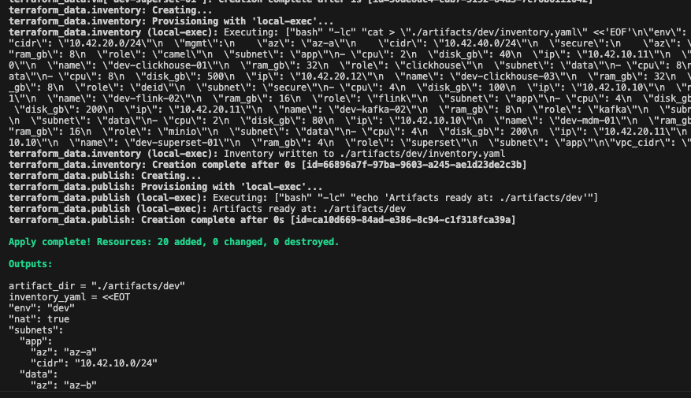

# Задание 4. Проектирование облачной инфраструктуры с применением IaaS и Terraform 1.

## 1

## 2
main.tf — описание инфраструктуры;
variables.tf — определение переменных;
outputs.tf — вывод ключевых параметров;
terraform.tfvars — значения переменных.

## 3

## 4
